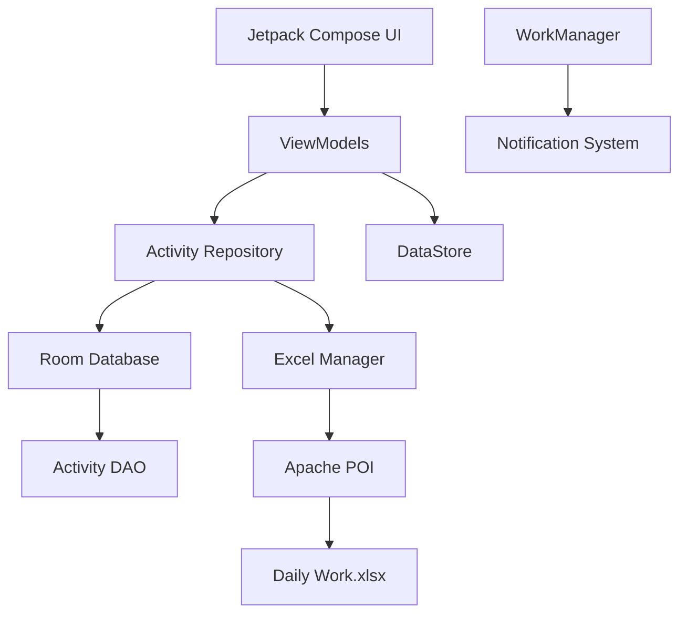

<div align="center">
  
# Daily Work Tracker

<p align="center">
  
  &nbsp;&nbsp;
  
  &nbsp;&nbsp;
  
  &nbsp;&nbsp;
  
  &nbsp;&nbsp;
  
  &nbsp;&nbsp;
  
  &nbsp;&nbsp;
  
  &nbsp;&nbsp;
  
  &nbsp;&nbsp;
  
</p>

*A privacy-focused Android productivity tracker that turns daily activities into meaningful insights while keeping your data under your control.*

[](https://kotlinlang.org)
[](#)
[](#)
[](#)
[](#)
[](https://opensource.org/licenses/MIT)

</div>

## Table of Contents
- [Overview](#overview)
- [Feature Showcase](#feature-showcase)
- [Screenshots](#screenshots)
- [How It Works](#how-it-works)
- [Architecture & Data Flow](#architecture--data-flow)
- [Project Structure](#project-structure)
- [Technology Stack](#technology-stack)
- [Installation Guide](#installation-guide)
- [Commands](#commands)
- [Data & Privacy](#data--privacy)
- [Roadmap](#roadmap)
- [Contributing](#contributing)
- [License](#license)

---

## Overview

### What is Daily Work Tracker?
Daily Work Tracker is an advanced productivity analytics tool built specifically for Android. Unlike typical to-do lists, this application serves as a comprehensive life and work tracker. 

It solves a core problem for power users: **Data Ownership**. Instead of locking your activities into a proprietary cloud database, Daily Work Tracker uses **your own Excel file (`.xlsx`)** as the permanent source of truth. You connect your file once, and the app seamlessly reads, caches, and syncs your data while providing rich visual analytics.

### How Users Interact with the App
1. **Connect:** Select your local `Daily Work.xlsx` file using the Android file picker.
2. **Track:** Add your daily activities, set durations, and categorize them (e.g., Work, Study, Exercise).
3. **Review:** Check off completed items or skip them.
4. **Analyze:** Explore the progress tab for deep weekly, monthly, and yearly insights.
5. **Remember:** Enable daily push notifications to remind you to log your work.

---

## Feature Showcase

### 📊 Productivity Analytics
- **Daily Summaries:** Quick highlights and areas for improvement for today.
- **Weekly Progress:** 7-day completion bars and total productive hours.
- **Monthly Analysis:** Category distribution and consistency tracking.
- **Yearly Overview:** Long-term trends and "best month" highlights.

### 📝 Activity Tracking
- **CRUD Operations:** Create, Read, Update, Delete activities.
- **Time Tracking:** Start/end times with auto-calculated durations.
- **Categories:** Organize by type (Work, Personal, Exercise, etc.).
- **Exercise Tracking:** Dedicated toggle for fitness tracking.

### 📅 History & Discovery
- **Calendar Heatmap:** Visual representation of productive days.
- **Date-based Navigation:** easily browse past logs.

### 🔎 Search & Filter
- **Debounced Text Search:** Find tasks instantly.
- **Advanced Filtering:** Filter by Status (Pending/Completed), Category, or Exercise.

### 🔔 Notifications
- **Daily Reminders:** Configurable push notifications.
- **Smart Permissions:** Handles Android 13+ runtime notification permissions gracefully.
- **Boot Persistence:** Reminders survive device reboots.

### 💾 Data Management
- **Excel First:** Reads and writes to `.xlsx` using Apache POI.
- **Backup & Export:** Easily share or back up your Excel file.
- **Manual Sync:** Force-sync data between the UI and your file.

---

## Screenshots

*(Placeholder: Add screenshots to the `docs/images/` directory to showcase the UI)*

<p align="center">
  
  
  
  
</p>

* **Home Screen:** Shows today's quick stats, a dynamic progress ring, and recent activities. Includes shimmer loading effects.*
* **Activities Screen:** A paginated, animated list of all tasks.
* **Analytics Screen:** Deep dives into your weekly and monthly productivity.
* **Settings Screen:** Manage your Excel connection, configure notifications, and handle backups.*

---

## How It Works

### User Workflow
```text
Open App
   ↓
Connect Excel File via System Picker
   ↓
Load Existing Data (Shimmer Loading)
   ↓
Dashboard (View Today's Progress)
   ↓
Add / Edit Activities
   ↓
Track Progress (Weekly/Monthly)
   ↓
Configure Daily Reminder (Optional)
```

### Developer Workflow
```text
Clone Repository
   ↓
Open in Android Studio
   ↓
Gradle Sync (Downloads Apache POI)
   ↓
Build & Run on Emulator
   ↓
Test Features
   ↓
Commit & Push
```

---

## Architecture & Data Flow

Daily Work Tracker uses an **Offline-First MVVM** architecture. The Room database serves as a fast local cache so the UI never blocks while waiting for Excel file I/O.

### Architecture Diagram



### Data Lifecycle
- **Read Flow:** UI observes `StateFlow` from the ViewModel. The Repository fetches data from `Room` for instant display, while `ExcelManager` parses the `.xlsx` file in the background and updates `Room`.
- **Write Flow:** When an activity is added/edited, it is immediately saved to `Room` (updating the UI), and then the Repository queues a sync operation to write the change to the `Excel` file via SAF.
- **Sync Flow:** Handled via a robust copy-to-temp-and-overwrite strategy to prevent SAF corruption during writes.

---

## Project Structure

```text
AI-daily-analysis/
├── app/
│   └── src/
│       └── main/
│           ├── java/com/dailyworktracker/
│           │   ├── data/
│           │   │   ├── db/            # Room Database & DAO
│           │   │   ├── excel/         # ExcelManager (Apache POI)
│           │   │   ├── model/         # Entities & Enums
│           │   │   ├── preferences/   # DataStore
│           │   │   └── repository/    # ActivityRepository
│           │   ├── notification/      # WorkManager & BootReceiver
│           │   ├── ui/
│           │   │   ├── components/    # Reusable UI (Animated Cards)
│           │   │   ├── navigation/    # NavGraph & Transitions
│           │   │   ├── screens/       # Feature Screens
│           │   │   ├── theme/         # Material 3 Theme
│           │   │   └── viewmodel/     # Shared ViewModels
│           │   ├── AppContainer.kt    # Manual DI Container
│           │   ├── DailyWorkTrackerApp.kt
│           │   └── MainActivity.kt    # Entry Point & Permissions
│           └── res/                   # Drawables, Values, Strings
├── gradle/                            # Gradle Wrapper
├── CHANGELOG.md                       # Version History
├── PROJECT_STATUS.md                  # Current Dev Status
├── CONTRIBUTING.md                    # Contributor Guide
├── build.gradle.kts                   # Project Build Config
└── README.md
```

---

## Technology Stack

| Technology | Purpose |
| :--- | :--- |
| **Kotlin** | Application programming language |
| **Jetpack Compose** | Modern declarative UI toolkit |
| **Material 3** | Design system and components |
| **Room** | Local SQLite database / offline cache |
| **Apache POI** | Excel (`.xlsx`) parsing and manipulation |
| **Kotlin Coroutines** | Asynchronous operations and concurrency |
| **StateFlow** | Reactive state management |
| **WorkManager** | Reliable background task scheduling (Notifications) |
| **DataStore** | Type-safe shared preferences |
| **Storage Access Framework** | Secure file access |

---

## Installation Guide

1. **Install Android Studio** (Hedgehog 2023.1.1 or newer recommended).
2. **Clone the repository:**
   ```bash
   git clone https://github.com/kavinkumar20066/AI-daily-analysis.git
   ```
3. **Open the project** in Android Studio.
4. **Allow Gradle Sync** to complete. *Note: Apache POI is a large dependency, so the first sync may take a few minutes.*
5. **Connect an Emulator or Physical Device** (Minimum API 26).
6. **Run the app** (`Shift + F10` or the Play button).
7. Accept notification permissions when prompted (Android 13+).
8. **Connect your Excel file** to start tracking!

---

## Commands

If you prefer to use the command line, you can use the included Gradle wrapper.

### Build Debug APK
**Windows:**
```powershell
.\gradlew.bat assembleDebug
```
**Linux / macOS:**
```bash
./gradlew assembleDebug
```
*The APK will be generated at: `app/build/outputs/apk/debug/app-debug.apk`*

### Clean & Build
```powershell
.\gradlew.bat clean
.\gradlew.bat assembleDebug
```

### Run Tests
```powershell
.\gradlew.bat test
```

---

## Data & Privacy

**100% Offline & Private:** 
Daily Work Tracker is entirely offline. There is no remote backend, telemetry, or cloud database tracking your activities. 

- **Data Storage:** Your data lives exclusively in two places:
  1. The secure, internal App Sandbox (Room Cache).
  2. The Excel file **you provide** on your device storage.
- **Permissions:** 
  - `POST_NOTIFICATIONS`: Requested strictly for daily reminders.
  - File access is handled securely via the Android Storage Access Framework (SAF), meaning the app can *only* access the specific file you explicitly choose.

---

## Roadmap

| Status | Feature |
| :---: | :--- |
| ✅ | Complete MVVM + Room architecture |
| ✅ | Excel Engine integration via SAF |
| ✅ | Activity CRUD and Time Tracking |
| ✅ | Dashboard, Shimmer Loading, & UI Polish |
| ✅ | Detailed Analytics (Weekly, Monthly, Yearly) |
| ✅ | Notifications (WorkManager + Boot Receiver) |
| 🚧 | Advanced Charting (Vico library integration) |
| 📌 | Custom goals (e.g., "Exercise 3x a week") |
| 📌 | CSV/JSON import & export |

---

## Contributing

We welcome contributions! Please see [CONTRIBUTING.md](CONTRIBUTING.md) for details on how to set up the project, branch out, and submit a pull request.

---

## License

This project is licensed under the [MIT License](LICENSE).
